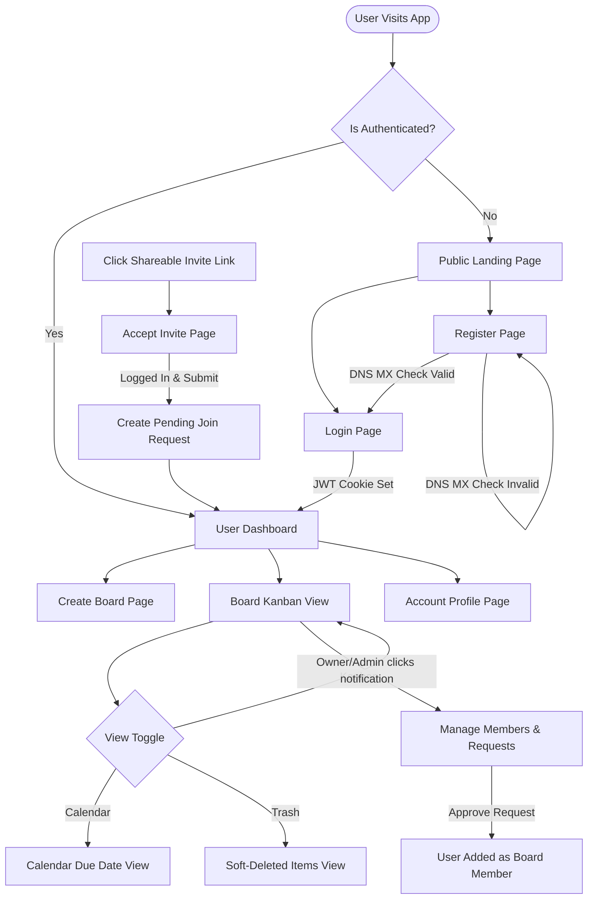
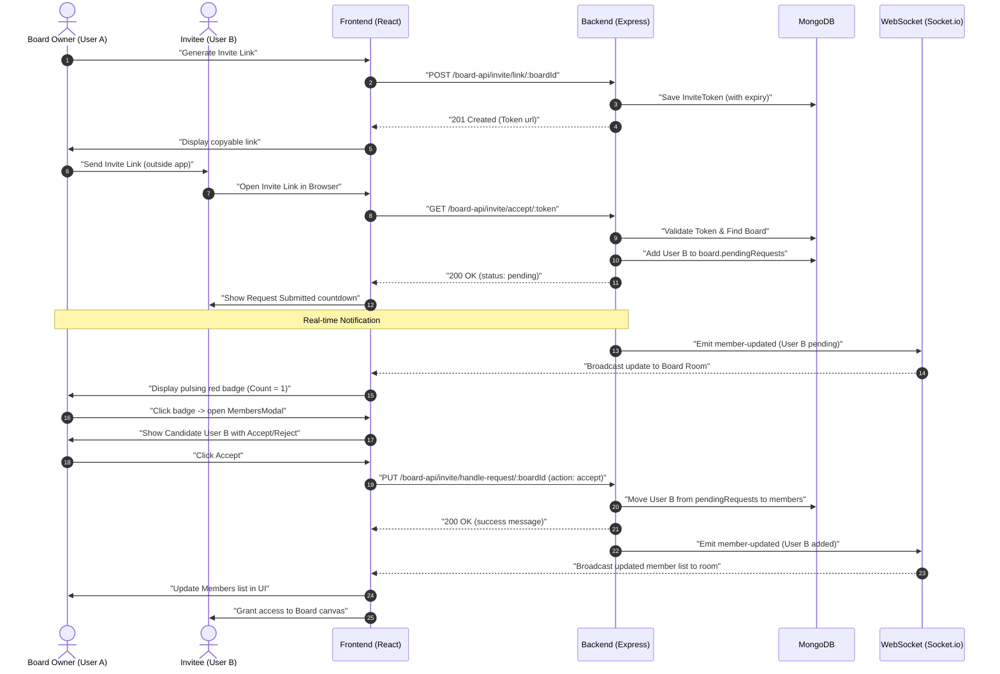
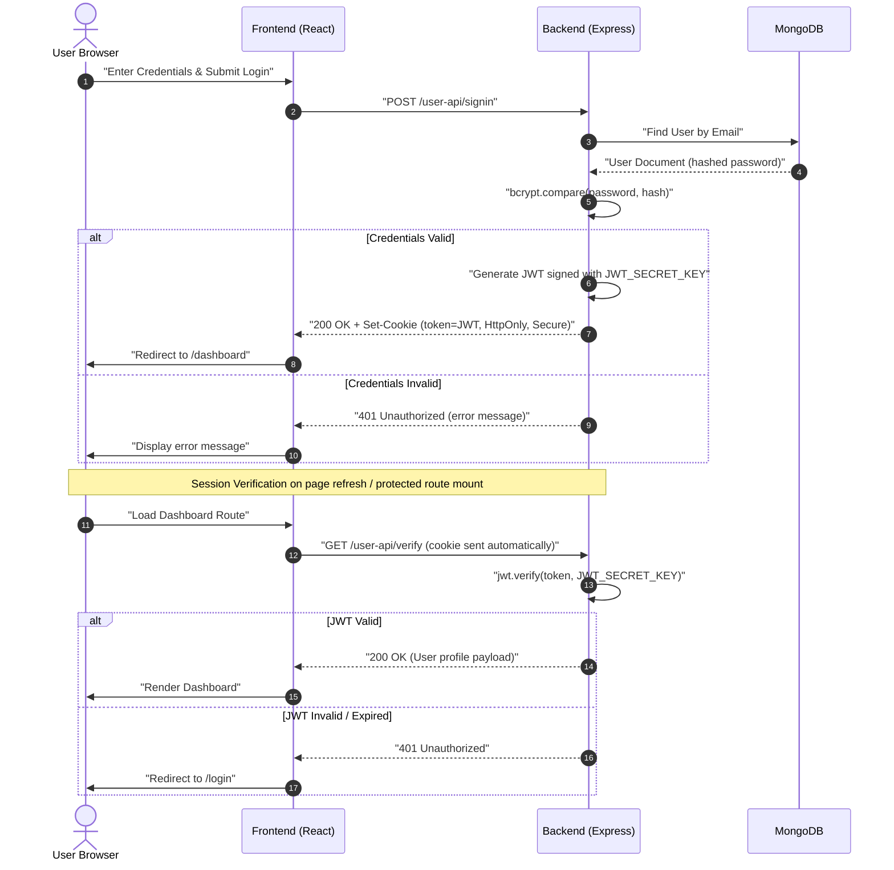
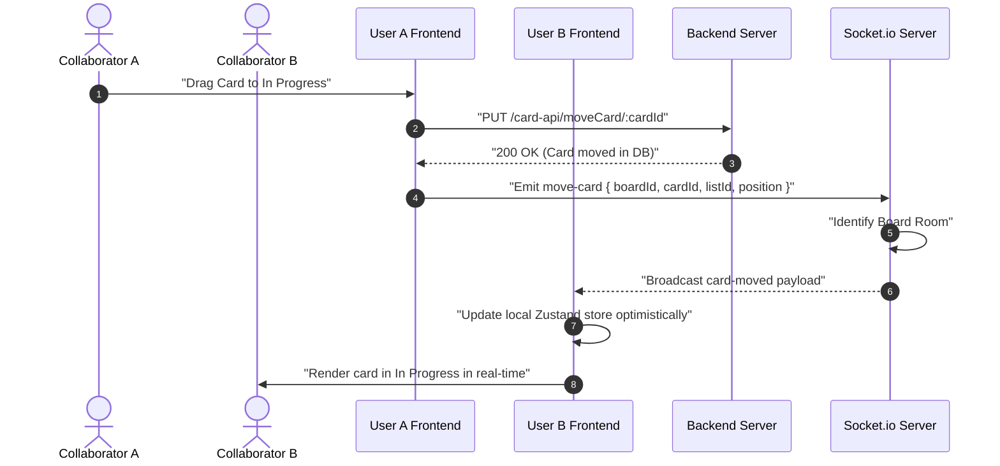

# Task Manager — Full-Stack Kanban Application

A full-stack, real-time collaborative Kanban task management application built with **React + Vite** on the frontend and **Node.js + Express + MongoDB** on the backend. It supports Google OAuth, JWT-based session management via HttpOnly cookies, Cloudinary file uploads, Socket.io real-time sync, and a soft-delete trash system.

---

## Monorepo Structure

```
task-managerr/
├── client/                  # React + Vite frontend application
│   ├── src/
│   │   ├── components/      # Shared UI components (Board, Card, Modal, Navbar…)
│   │   ├── context/         # Zustand stores (AuthContext, BoardContext)
│   │   ├── pages/           # Route-level page components
│   │   ├── services/        # Axios base URL config
│   │   ├── socket/          # Socket.io client setup
│   │   └── utils/           # Shared utility helpers
│   ├── public/
│   ├── index.html
│   ├── vite.config.js
│   └── package.json
│
├── server/                  # Express + MongoDB backend application
│   ├── Apis/                # Express Router definitions (UserApi, BoardApi, …)
│   ├── config/              # DB and Cloudinary configuration
│   ├── controllers/         # Business logic for each resource
│   ├── models/              # Mongoose schemas (User, Board, List, Card, …)
│   ├── sockets/             # Socket.io event handlers
│   ├── utils/               # Token generation, upload middleware, activity logger
│   ├── server.js            # Express + HTTP + Socket.io app entry point
│   └── package.json
│
├── all_changes_log.md       # Running changelog
└── README.md                # ← You are here
```

---

## Feature Overview

| Feature | Details |
|---|---|
| **Authentication** | Email/password signup & login, Google OAuth 2.0 |
| **Session Security** | JWT stored in HttpOnly cookies; verified server-side on every protected request |
| **Kanban Boards** | Create, edit, delete, restore boards with custom backgrounds |
| **Lists & Cards** | Full CRUD with drag-and-drop card movement and position persistence |
| **Collaboration** | Invite members via email or shareable link with request-and-approval flow (accept/reject pending users); role system (Owner → Admin → Member) |
| **Real-time Sync** | Socket.io broadcasts board, list, card, and member events to all active collaborators |
| **File Uploads** | Avatar (5 MB image) and card attachments/remarks (10 MB, multi-format) via Cloudinary |
| **Trash System** | Soft-delete for boards, lists, and cards; full restore and permanent-delete support |
| **Activity Log** | Per-board activity trail with actor details |
| **Calendar View** | FullCalendar integration showing card due dates |

---

## Application Flow Diagrams

### 1. General Application Navigation & Page Flow

This flowchart describes the screen routing and authentication logic flows throughout the application.



### 2. Request-and-Approval Invite Link Flow

This sequence diagram depicts how a guest requests to join a board via a shareable token link and how the board owner or admin handles it with real-time feedback.



---

## Technology Stack

### Frontend (`/client`)

| Technology | Version | Purpose |
|---|---|---|
| React | 19.x | UI library |
| Vite | 7.x | Build tool & dev server |
| Tailwind CSS | 4.x | Utility-first styling |
| Zustand | 5.x | Global state management |
| Axios | 1.x | HTTP client for API calls |
| React Router | 7.x | Client-side routing |
| React Hook Form | 7.x | Form state & validation |
| Socket.io-client | 4.x | Real-time WebSocket client |
| @react-oauth/google | 0.13.x | Google Sign-In button |
| FullCalendar | 6.x | Calendar view for due dates |
| React Hot Toast | 2.x | Toast notifications |

### Backend (`/server`)

| Technology | Version | Purpose |
|---|---|---|
| Node.js | 18+ | JavaScript runtime |
| Express | 5.x | Web framework |
| Mongoose | 9.x | MongoDB ODM |
| bcryptjs | 3.x | Password hashing |
| jsonwebtoken | 9.x | JWT generation & verification |
| cookie-parser | 1.x | HttpOnly cookie parsing |
| Socket.io | 4.x | Real-time WebSocket server |
| Multer | 2.x | Multipart file upload middleware |
| Cloudinary | 2.x | Cloud file storage |
| google-auth-library | 10.x | Google OAuth token verification |
| dotenv | 16.x | Environment variable loading |
| cors | 2.x | Cross-origin request control |
| nodemon | 3.x | Auto-restart dev server |

---

## Authentication & Security Architecture



- **HttpOnly cookies** — token is never accessible via JavaScript, preventing XSS theft
- **JWT expiry** — tokens expire after `1d`; session is re-verified on each page load via `/user-api/verify`
- **Role-based access** — Board controllers enforce Owner / Admin / Member permission checks before mutating data
- **CORS** — restricted to `CLIENT_URL` with `credentials: true`

---

## Real-Time Events (Socket.io)

All board collaborators join a Socket.io room identified by `boardId`. Any mutating action (add/update/delete card, list, or board setting) emits the corresponding event to the room.



| Emit Event | Broadcast Event | Payload |
|---|---|---|
| `join-board` | `online-users` | `[{ socketId, user }]` |
| `move-card` | `card-moved` | `{ boardId, cardId, … }` |
| `card-added` | `card-added` | `{ boardId, card }` |
| `card-updated` | `card-updated` | `{ boardId, card }` |
| `card-deleted` | `card-deleted` | `{ boardId, cardId }` |
| `list-added` | `list-added` | `{ boardId, list }` |
| `list-updated` | `list-updated` | `{ boardId, list }` |
| `list-deleted` | `list-deleted` | `{ boardId, listId }` |
| `board-updated` | `board-updated` | `{ boardId, board }` |
| `member-updated` | `member-updated` | `{ boardId, members }` |
| `leave-board` | `online-users` (updated) | — |

---

## Quick Start (Local Development)

### Prerequisites

- Node.js ≥ 18
- npm ≥ 9
- A running MongoDB instance (local or Atlas)
- A Cloudinary account
- A Google Cloud project with OAuth 2.0 credentials

### 1. Clone the repository

```bash
git clone <your-repo-url>
cd task-managerr
```

### 2. Set up the Server

```bash
cd server
npm install
cp envexample.txt .env   # then fill in your values (see server/README.md)
npm run dev              # starts on http://localhost:4001
```

### 3. Set up the Client

```bash
cd ../client
npm install
cp envexample.txt .env   # then fill in your values (see client/README.md)
npm run dev              # starts on http://localhost:5173
```

---

## Sub-Directory Documentation

| README | Contents |
|---|---|
| [`client/README.md`](./client/README.md) | React architecture, Zustand stores, component map, Axios setup, environment variables, and full client setup guide |
| [`server/README.md`](./server/README.md) | Express pipeline, Mongoose models, REST API reference, auth flow, Multer/Cloudinary, Socket.io, and deployment guide |

---

## Deployment

| Tier | Platform | Notes |
|---|---|---|
| **Backend** | [Render](https://render.com) | Web Service; set all env vars in Render dashboard |
| **Frontend** | [Vercel](https://vercel.com) / [Netlify](https://netlify.com) | Static site; set `VITE_API_URL` to the Render service URL |
| **Database** | [MongoDB Atlas](https://www.mongodb.com/atlas) | M0 free tier is sufficient for development |
| **Media** | [Cloudinary](https://cloudinary.com) | Free tier supports avatars + attachments |

---

## License

ISC
