# 📋 Task Manager — Full Stack Application

A full-featured collaborative task management application built with **React**, **Node.js/Express**, **MongoDB**, and **Socket.IO**. Supports real-time board collaboration, role-based access control, soft-delete trash management, card drag-and-drop, due dates, priorities, assignees, and email/link-based board invitations.

---

## 🗂️ Project Structure

```
task-managerr/
├── client/               # React + Vite frontend
│   ├── src/
│   │   ├── components/   # Reusable UI components
│   │   ├── context/      # Zustand store (BoardContext) and AuthContext
│   │   │   └── slices/   # Zustand modular slices (board, list, card, etc.)
│   │   ├── pages/        # Route-level page components (Modular directories)
│   │   │   ├── BoardPage/
│   │   │   ├── UserDashboard/
│   │   │   ├── Home/
│   │   │   └── RegisterPage/
│   │   ├── services/     # Axios base URL config
│   │   ├── socket/       # Socket.IO client service
│   │   └── utils/        # Utility helpers
│   ├── index.html
│   ├── vite.config.js
│   └── package.json
│
├── server/               # Node.js + Express backend
│   ├── Apis/             # Express routers (Modular index.js barrel files)
│   ├── config/           # MongoDB connection
│   ├── controllers/      # Route handler logic (Modularized per feature)
│   │   ├── auth/
│   │   ├── board/
│   │   ├── list/
│   │   ├── card/
│   │   └── invite/
│   ├── models/           # Mongoose schemas (Extracted sub-schemas)
│   ├── sockets/          # Socket.IO handlers
│   │   ├── handlers/     # Feature-specific socket logic
│   │   ├── onlineUsersStore.js
│   │   └── boardSocket.js
│   ├── utils/            # JWT, Uploads, Cloudinary middleware
│   ├── server.js         # App entry point
│   └── package.json
│
├── abhi.http             # REST API test file
├── test.http             # Additional API test file
└── README.md             # ← You are here
```

---

## 🏗️ System Architecture

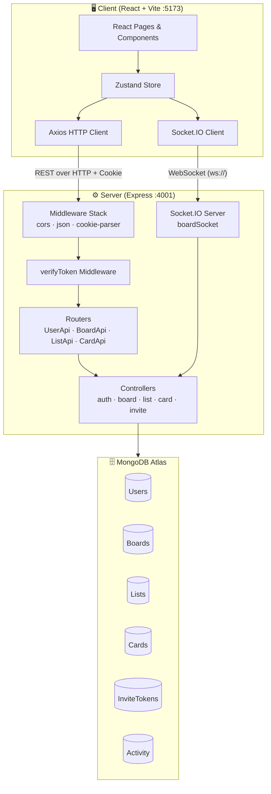

---

## ⚡ Quick Start (Local Development)

### Prerequisites

| Tool | Version |
|------|---------|
| Node.js | v18+ |
| npm | v9+ |
| MongoDB Atlas | Active cluster |

### 1. Clone the repository

```bash
git clone <your-repo-url>
cd task-managerr
```

### 2. Start the backend server

```bash
cd server
npm install
# Create .env file (see server/README.md for required variables)
npm run dev
# Server runs at http://localhost:4001
```

### 3. Start the frontend client

```bash
cd client
npm install
npm run dev
# Client runs at http://localhost:5173
```

---

## 🏗️ Tech Stack Overview

| Layer | Technology |
|-------|-----------|
| Frontend Framework | React 19 + Vite 7 |
| Styling | Tailwind CSS v4 |
| State Management | Zustand v5 |
| Forms & Validation | React Hook Form v7 |
| HTTP Client | Axios v1 |
| Real-time | Socket.IO v4 (client + server) |
| Calendar View | FullCalendar v6 |
| File Uploads | Multer (memory storage) + Cloudinary v2 |
| Backend Framework | Express v5 |
| Database | MongoDB via Mongoose v9 |
| Authentication | JWT + HttpOnly Cookies |
| Password Hashing | bcryptjs |
| Notifications | react-hot-toast |
| Dev Server | Nodemon (server) / Vite (client) |

---

## 🔐 Authentication Flow

1. User registers via `POST /user-api/signup` → password hashed with bcrypt (salt rounds: 8)
2. User logs in via `POST /user-api/signin` → JWT signed and set as **HttpOnly cookie** (`token`, 7-day expiry)
3. All protected routes run through the `verifyToken` middleware which reads the cookie
4. Session validation: `GET /user-api/verify` — used on app load to restore auth state
5. Logout: `POST /user-api/logout` → clears the `token` cookie

### Sequence: User Registration

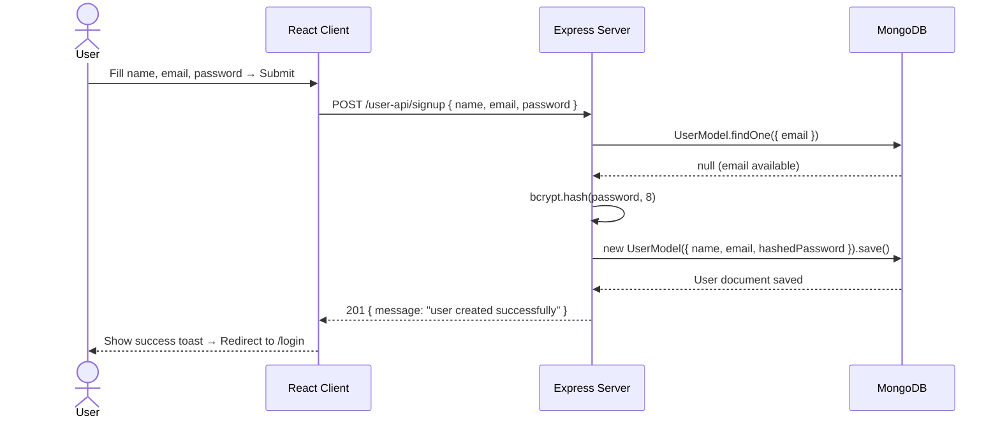

### Sequence: User Login

```mermaid
sequenceDiagram
    actor U as User
    participant C as React Client
    participant S as Express Server
    participant DB as MongoDB

    U->>C: Enter email + password → Submit
    C->>S: POST /user-api/signin { email, password }
    S->>DB: UserModel.findOne({ email })
    DB-->>S: User document (with hashed password)
    S->>S: bcrypt.compare(password, user.password)
    alt Credentials valid
        S->>S: jwt.sign({ id: user._id }, JWT_SECRET, { expiresIn: "1d" })
        S-->>C: 200 { payload: user } + Set-Cookie: token=JWT; HttpOnly; SameSite=Lax
        C->>C: AuthContext.setUser(user)
        C-->>U: Redirect to /dashboard
    else Invalid credentials
        S-->>C: 401 { message: "invalid credentials" }
        C-->>U: Show error toast
    end
```

### Sequence: Session Restore on App Load

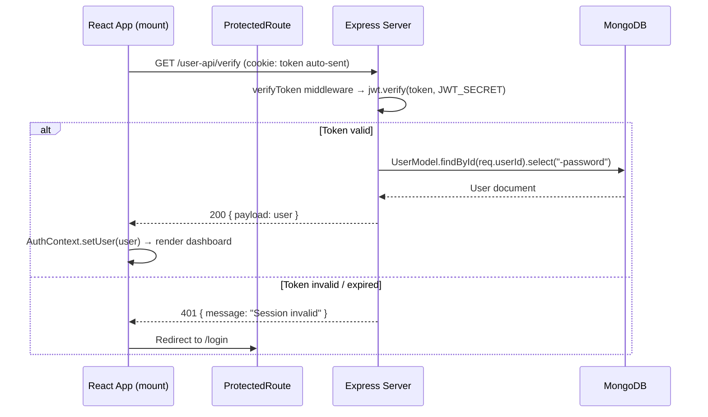

### Sequence: Logout

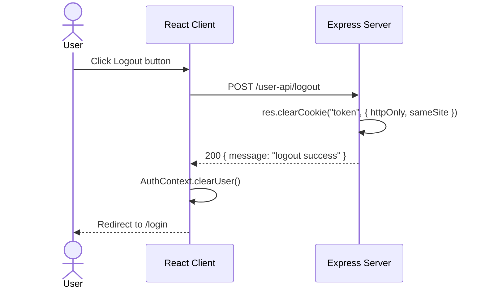

---

## 🌐 API Base Routes

| Router Mount | Description |
|--------------|-------------|
| `/user-api` | Auth — signup, signin, logout, session verify, user search |
| `/board-api` | Board CRUD, trash, invitations, member management |
| `/list-api` | List CRUD + soft-delete trash |
| `/card-api` | Card CRUD, move, soft-delete trash |

> See `server/README.md` for the complete endpoint reference with payloads.

---

## 🔄 Real-time Collaboration (Socket.IO)

| Event | Direction | Description |
|-------|-----------|-------------|
| `join-board` | Client → Server | Join a board room |
| `leave-board` | Client → Server | Leave a board room |
| `card-added` | Broadcast | New card broadcast |
| `card-updated` | Broadcast | Card edit broadcast |
| `card-deleted` | Broadcast | Card delete broadcast |
| `card-moved` / `move-card` | Broadcast | Drag-and-drop broadcast |
| `list-added` | Broadcast | New list broadcast |
| `list-updated` | Broadcast | List edit broadcast |
| `list-deleted` | Broadcast | List delete broadcast |
| `board-updated` | Broadcast | Board settings/title change |
| `member-updated` | Broadcast | Member promote/demote/remove |
| `online-users` | Server → Client | Active users in board room |

### Sequence: Real-Time Card Add (Multi-user)

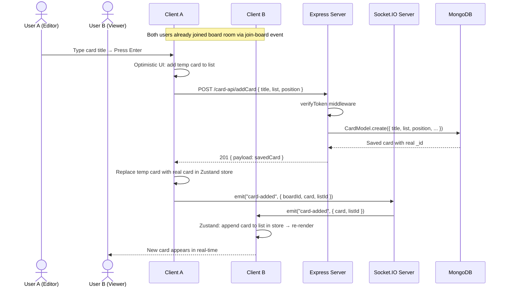

### Sequence: Real-Time Card Move (Drag & Drop)

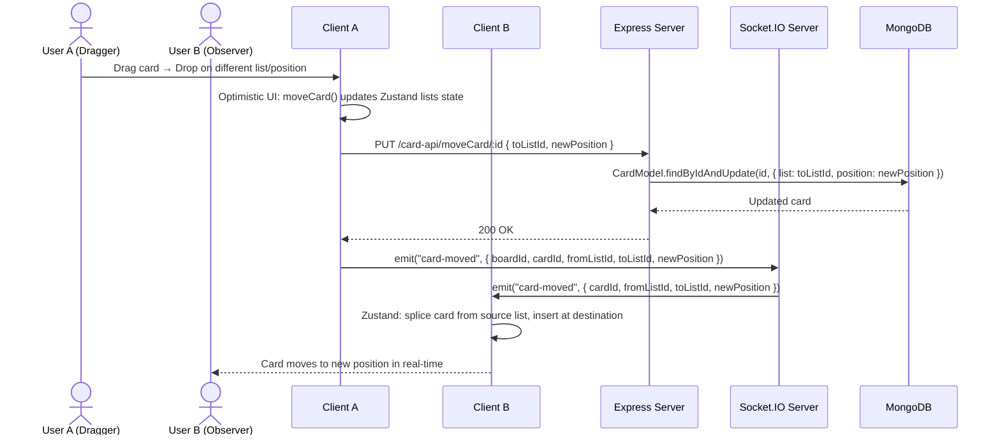

---

## 🗑️ Soft Delete / Trash System

All deletions are **soft deletes** — records receive `isDeleted: true` and a `deletedAt` timestamp. Items are recoverable from the Trash view in the UI. Permanent deletion purges the document from MongoDB.

### Sequence: Soft Delete → Restore → Permanent Delete (Board)

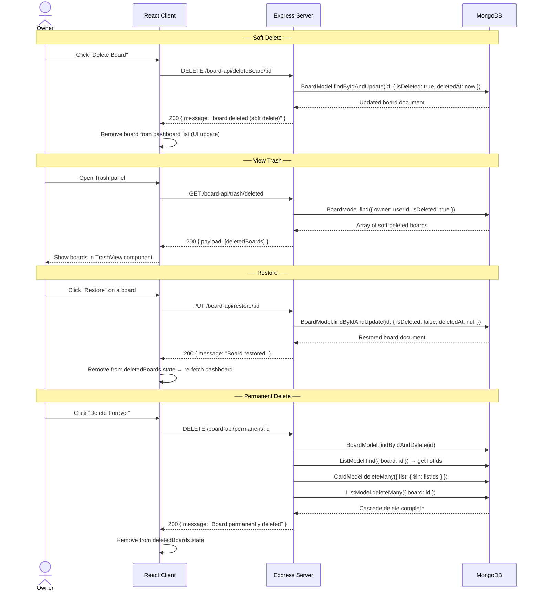

---

## 👥 Role-Based Access Control

| Role | Permissions |
|------|------------|
| **Owner** | Full access — create, edit, delete board, manage members, promote/demote admins |
| **Admin** | Edit board details, manage members, edit all cards |
| **Member** | View board, add cards, update card **status only** |

### Sequence: Card Update with Role Check

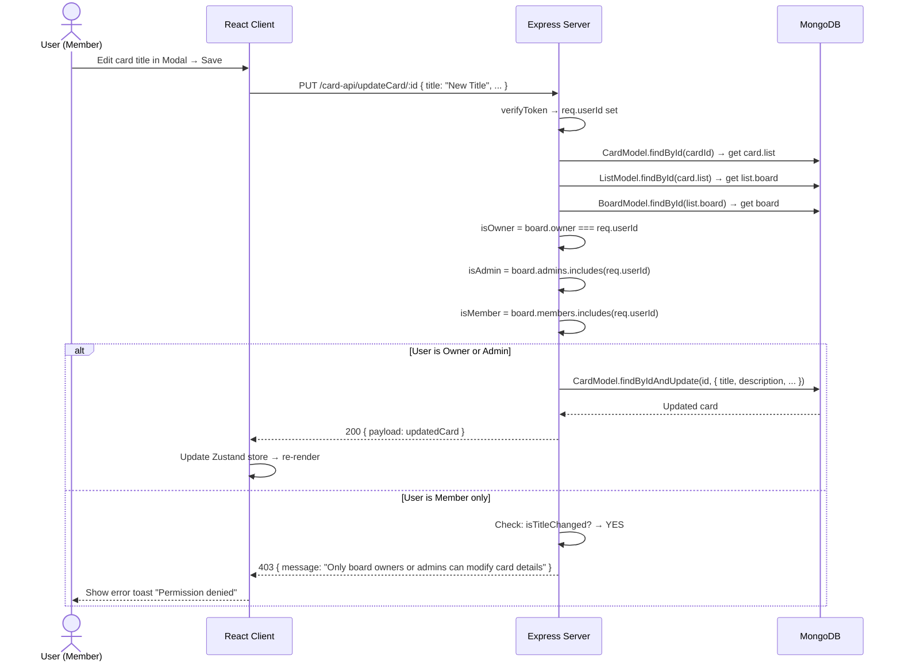

### Sequence: Member Management (Promote / Demote / Remove)

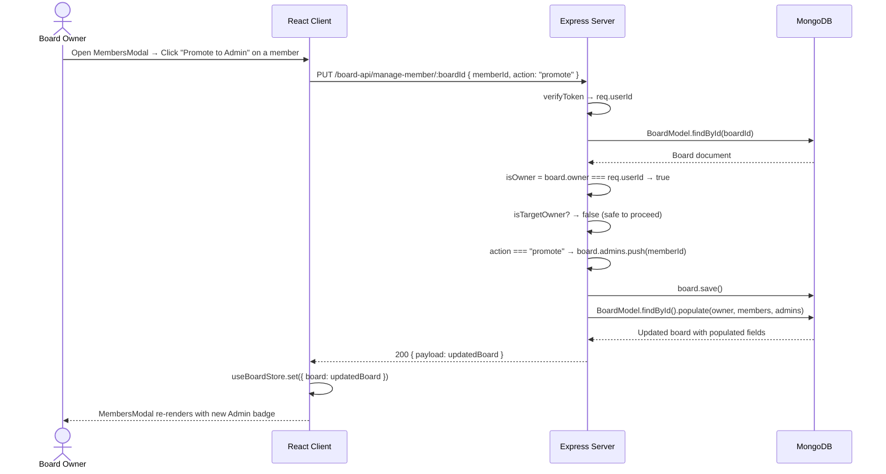

---

## 📬 Invite System

### Sequence: Email Invite (Direct Add)

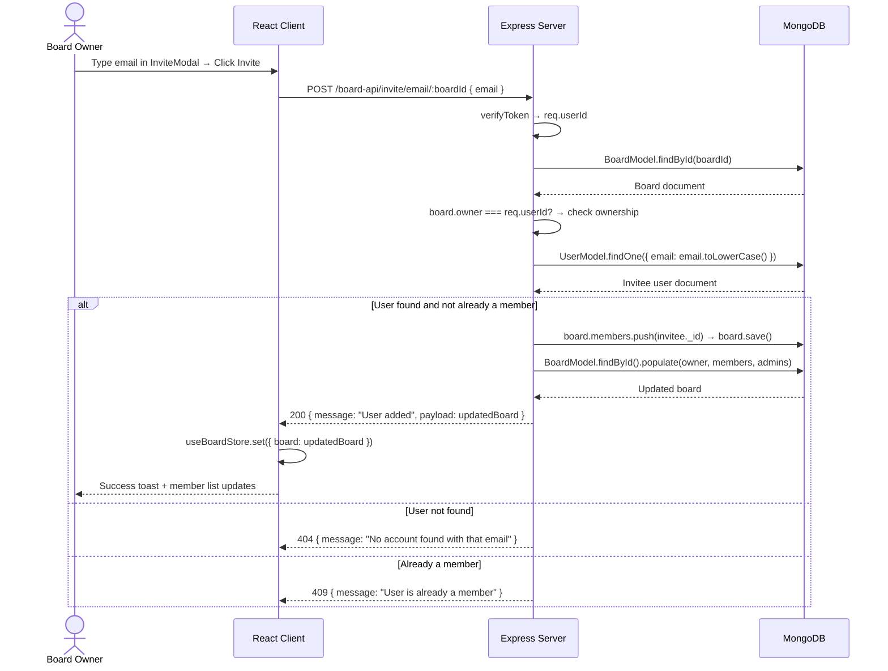

### Sequence: Link Invite (Generate + Accept)

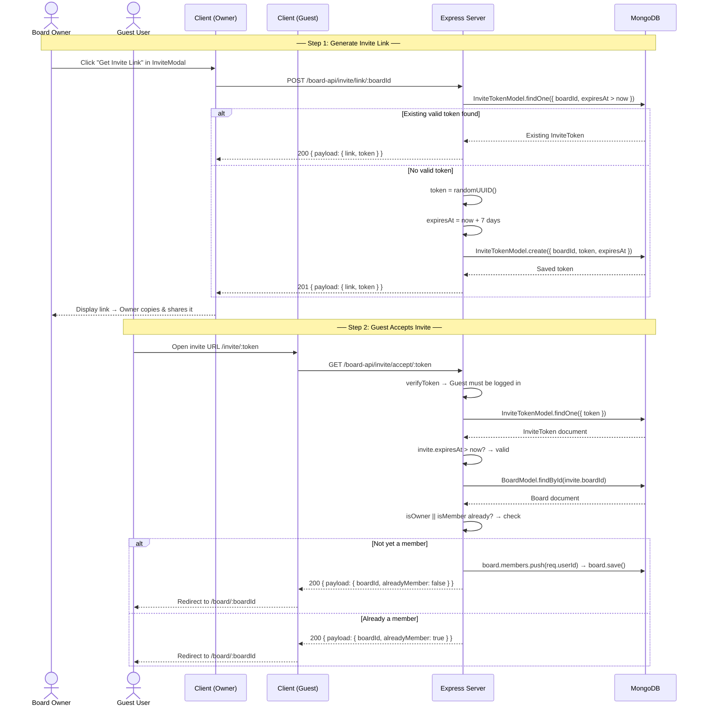

---

## 📎 File Upload & Attachment System

The application uses **Multer** (memory storage) on the backend to receive multipart file uploads, then streams the file buffers directly to **Cloudinary** via `cloudinary.uploader.upload_stream`. This avoids writing temporary files to disk.

### Supported Upload Types

| Feature | Field Name | Max Size | Allowed Types | Max Files |
|---------|-----------|----------|---------------|-----------|
| Avatar | `avatar` | 5 MB | Images only (`image/*`) | 1 |
| Card Attachments | `files` | 10 MB each | Images, PDF, Word, Excel, PowerPoint, Text, CSV, ZIP, RAR | 5 per request |
| Remark Attachments | `files` | 10 MB each | Same as card attachments | 5 per request |

### Card Attachment Endpoints

| Method | Endpoint | Description |
|--------|----------|-------------|
| `POST` | `/card-api/attachments/:cardId` | Upload files to a card (multipart/form-data) |
| `DELETE` | `/card-api/attachments/:cardId/:attachmentId` | Remove a specific attachment from a card |

### Remark Endpoints

| Method | Endpoint | Description |
|--------|----------|-------------|
| `POST` | `/card-api/remarks/:cardId` | Add a remark with optional file attachments |
| `DELETE` | `/card-api/remarks/:cardId/:remarkId` | Delete a specific remark |

### Avatar Upload Endpoint

| Method | Endpoint | Description |
|--------|----------|-------------|
| `POST` | `/user-api/upload-avatar` | Upload a profile picture (returns Cloudinary URL) |

### Sequence: File Upload to Cloudinary (Buffer Stream)

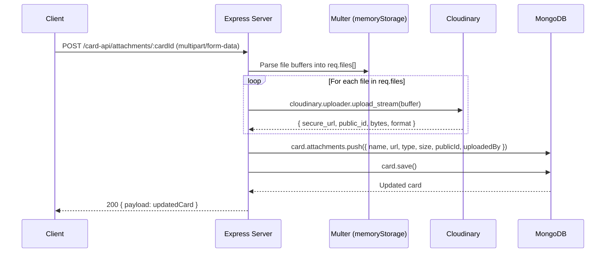

---

## 📝 Activity Logging

All significant board actions (card creation, movement, deletion, member changes, etc.) are logged via the `Activity` model. Activities are fetched and displayed in the `ActivityView` component.

### Activity Model Schema

| Field | Type | Required | Description |
|-------|------|----------|-------------|
| `board` | ObjectId → Board | ✅ | The board this activity belongs to |
| `user` | ObjectId → User | ✅ | The user who performed the action |
| `action` | String | ✅ | Human-readable description of the action |
| `timestamp` | Date | ❌ | Defaults to `Date.now` |

### Activity Endpoint

| Method | Endpoint | Description |
|--------|----------|-------------|
| `GET` | `/board-api/activity/:boardId` | Fetch all activity logs for a board |

---

## 📁 Detailed Documentation

| README | Contents |
|--------|----------|
| [`client/README.md`](./client/README.md) | React components, Zustand store, Axios setup, Tailwind design system, local dev setup |
| [`server/README.md`](./server/README.md) | Express routes, Mongoose models, JWT auth, REST API reference, deployment |
