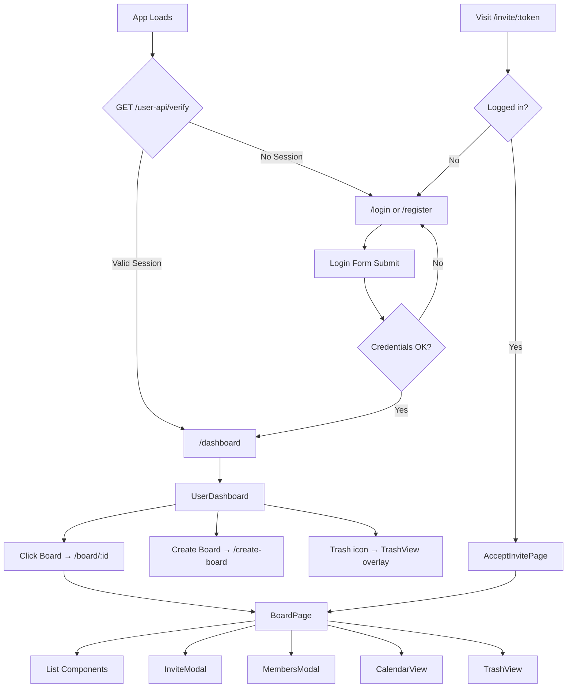
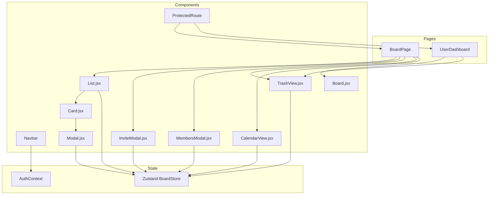
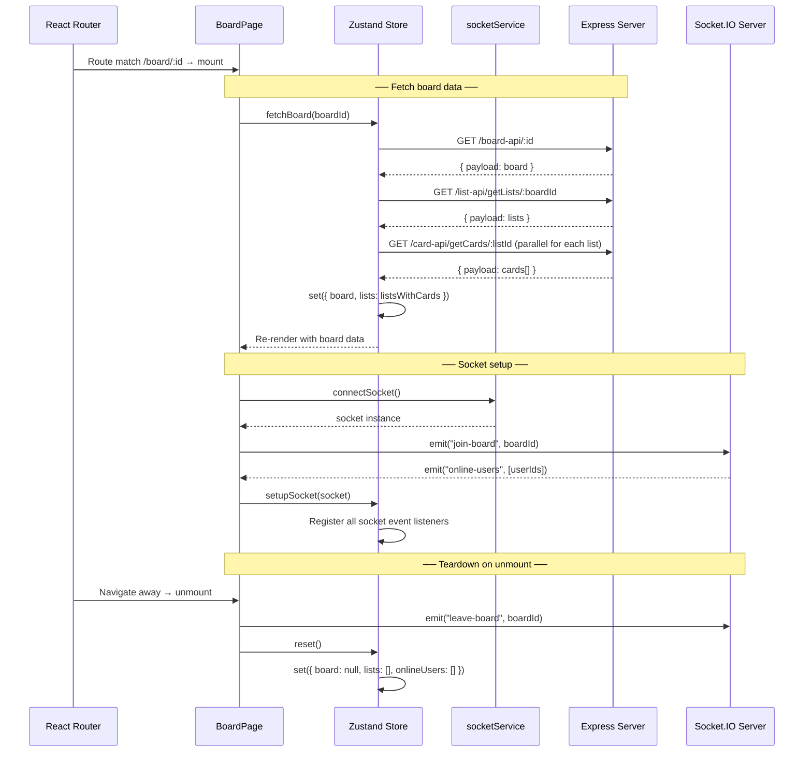
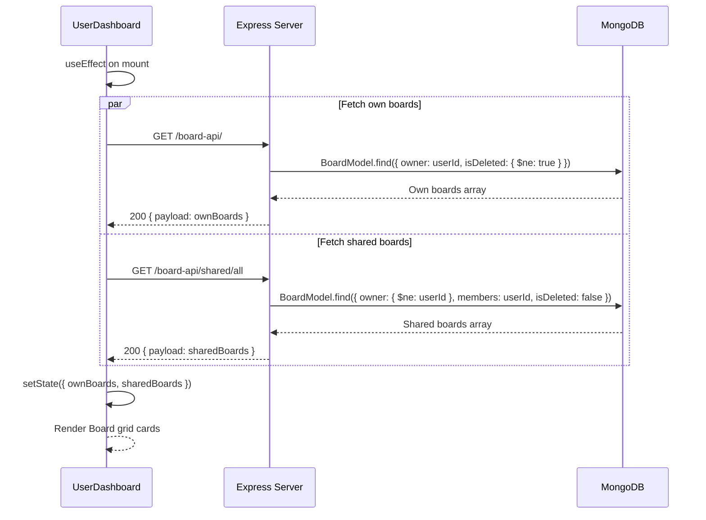
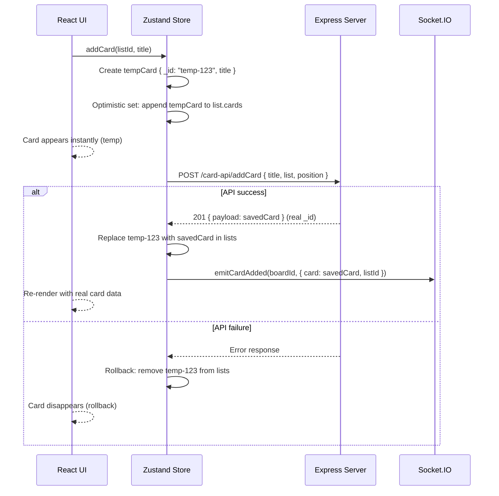
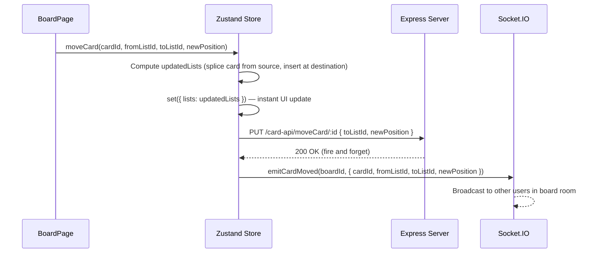
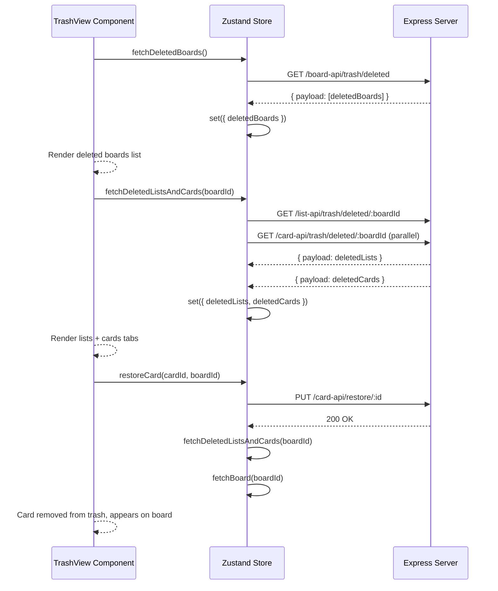
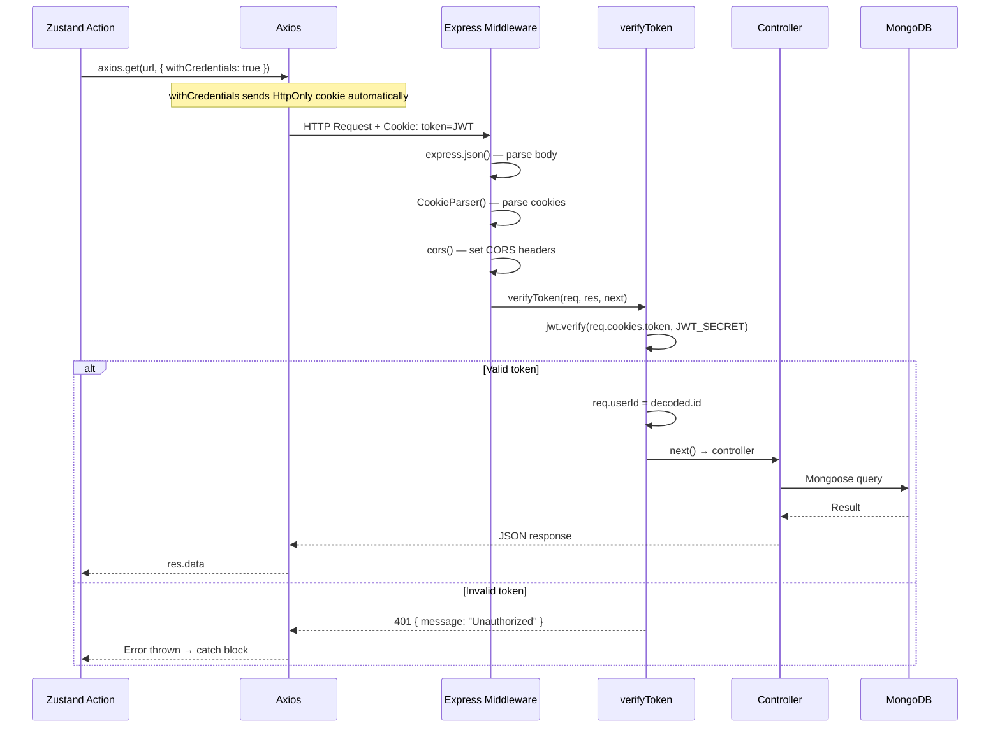
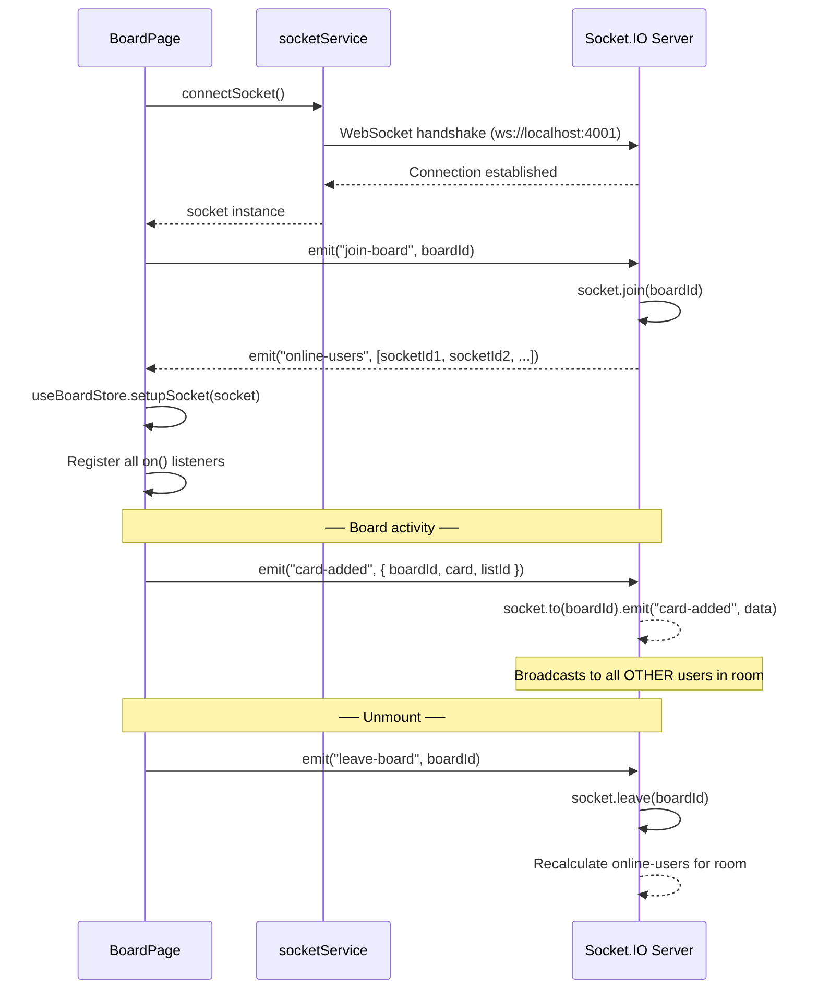
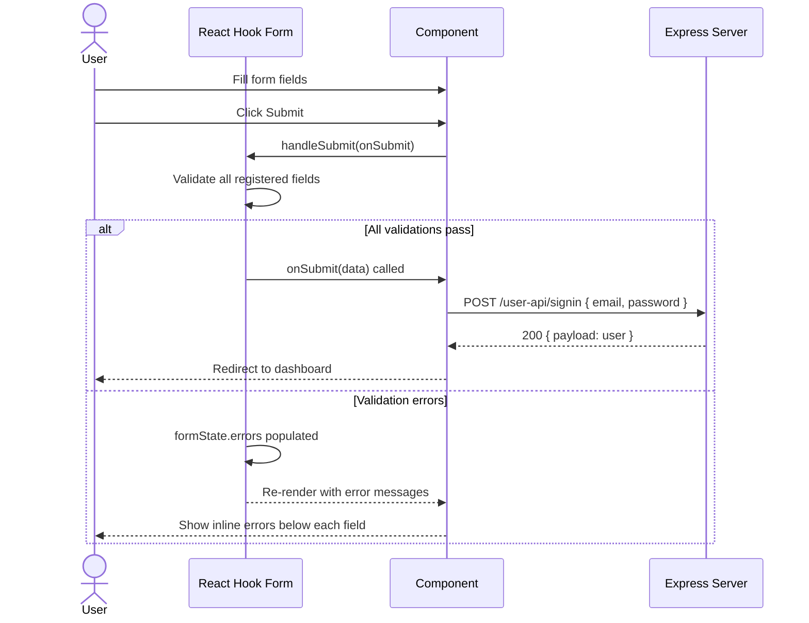

# 🖥️ Client — React Frontend Documentation

A **React 19 + Vite 7** single-page application with **Zustand** state management, **TailwindCSS v4** styling, **Socket.IO** real-time integration, and **React Hook Form** for validated forms.

---

## 📦 Packages

### Dependencies

| Package | Version | Purpose |
|---------|---------|---------|
| `react` | ^19.2.0 | UI component library |
| `react-dom` | ^19.2.0 | React DOM renderer |
| `react-router` | ^7.13.1 | Client-side routing |
| `zustand` | ^5.0.12 | Lightweight global state management |
| `axios` | ^1.13.6 | HTTP client for API calls |
| `react-hook-form` | ^7.71.2 | Form state management and validation |
| `react-hot-toast` | ^2.6.0 | Toast notification system |
| `socket.io-client` | ^4.8.3 | Real-time WebSocket client |
| `tailwindcss` | ^4.2.1 | Utility-first CSS framework |
| `@tailwindcss/vite` | ^4.2.1 | Vite plugin for Tailwind CSS v4 |
| `@fullcalendar/react` | ^6.1.20 | Calendar view component |
| `@fullcalendar/core` | ^6.1.20 | FullCalendar core engine |
| `@fullcalendar/daygrid` | ^6.1.20 | Month/week day-grid view |
| `@fullcalendar/timegrid` | ^6.1.20 | Time-grid view (hourly) |
| `@fullcalendar/interaction` | ^6.1.20 | Drag, drop & click interaction |

### Dev Dependencies

| Package | Version | Purpose |
|---------|---------|---------|
| `vite` | ^7.3.1 | Build tool & dev server |
| `@vitejs/plugin-react` | ^5.1.1 | React Fast Refresh + JSX transform |
| `eslint` | ^9.39.1 | JavaScript linter |
| `eslint-plugin-react-hooks` | ^7.0.1 | Lint React hooks rules |
| `eslint-plugin-react-refresh` | ^0.4.24 | Lint Fast Refresh compatibility |
| `@eslint/js` | ^9.39.1 | ESLint JS config |
| `@types/react` | ^19.2.7 | TypeScript types for React |
| `@types/react-dom` | ^19.2.3 | TypeScript types for React DOM |
| `globals` | ^16.5.0 | Browser/Node global variables for ESLint |

---

## 🚀 Project Setup — Step by Step

### Step 1 — Create the Vite + React project

```bash
npm create vite@latest client -- --template react
cd client
```

### Step 2 — Install all dependencies

```bash
# Core packages
npm install react-router zustand axios react-hook-form react-hot-toast socket.io-client

# Tailwind CSS v4 (Vite plugin)
npm install tailwindcss @tailwindcss/vite

# FullCalendar
npm install @fullcalendar/react @fullcalendar/core @fullcalendar/daygrid @fullcalendar/timegrid @fullcalendar/interaction
```

### Step 3 — Configure Tailwind CSS v4 in vite.config.js

```js
// vite.config.js
import { defineConfig } from 'vite'
import react from '@vitejs/plugin-react'
import tailwindcss from '@tailwindcss/vite'

export default defineConfig({
  plugins: [react(), tailwindcss()],
})
```

### Step 4 — Add Tailwind import to index.css

```css
/* src/index.css */
@import "tailwindcss";
```

### Step 5 — Set up environment variables

Create a `.env` file in the `client/` root:

```env
VITE_API_URL=http://localhost:4001
```

### Step 6 — Create the API base URL service

```js
// src/services/api.js
export const API_URL = import.meta.env.VITE_API_URL || "http://localhost:4001";
```

### Step 7 — Start development server

```bash
npm run dev
# App runs at http://localhost:5173

# Expose on local network (for mobile testing)
npm run dev -- --host
```

---

## 🎨 Design System & Layout Structure

### Color Palette

| Token | Usage |
|-------|-------|
| `bg-gray-900` / `bg-gray-800` | Primary dark backgrounds |
| `bg-gray-700` / `bg-gray-600` | Card / panel backgrounds |
| `text-white` / `text-gray-200` | Primary text |
| `text-gray-400` / `text-gray-500` | Muted / secondary text |
| `bg-blue-600` / `hover:bg-blue-700` | Primary action buttons |
| `bg-red-600` / `hover:bg-red-700` | Destructive actions |
| `border-gray-600` / `border-gray-700` | UI borders and dividers |

### Layout Structure

```
RootLayout
└── Navbar (persistent top bar)
    └── <Outlet> (page content)
        ├── Home (/) - Modularized component directory
        ├── LoginPage (/login)
        ├── RegisterPage (/register) - Modularized component directory
        ├── UserDashboard (/dashboard) - Modularized component directory
        │   ├── Sidebar
        │   ├── BoardsGrid
        │   ├── TrashGrid
        │   └── TrashView (modal overlay)
        ├── CreateBoardPage (/create-board)
        ├── BoardPage (/board/:id) - Modularized component directory
        │   ├── Header
        │   ├── Sidebar
        │   ├── List (×N)
        │   │   └── Card (×N)
        │   ├── InviteModal
        │   ├── MembersModal
        │   ├── CalendarView
        │   └── TrashView
        ├── AcceptInvitePage (/invite/accept/:token)
        └── AccountManagementPage
```

### Routing & Navigation Flow



### Security / Route Protection Matrix

| Route | Guard | Redirect |
|-------|-------|---------|
| `/dashboard` | `ProtectedRoute` — requires valid JWT session | `/login` |
| `/board/:id` | `ProtectedRoute` + board membership check | `/dashboard` |
| `/create-board` | `ProtectedRoute` | `/login` |
| `/invite/accept/:token` | `ProtectedRoute` — JWT + invite token validation | `/login` |

---

## ⚛️ React UI Components

### Component Interaction Map



### All Components

#### `Navbar.jsx`
- Persistent top navigation bar
- Displays app logo, user avatar, logout button
- Reads user from `AuthContext`

#### `ProtectedRoute.jsx`
- Wraps sensitive routes
- Calls `GET /user-api/verify` on mount to validate session
- Renders `<Navigate to="/login" />` if unauthenticated

#### `Board.jsx`
- Board thumbnail card displayed on UserDashboard
- Shows title, background color, owner info
- Navigates to `/board/:id` on click

#### `List.jsx`
- Kanban list column component
- Contains a vertical stack of `Card` components
- Inline title editing (double-click to activate)
- Add Card form at the bottom
- Drag target for card drop events

**State managed:**
- `isEditingTitle` — inline title edit mode
- `showAddCard` — toggles inline card creation form
- `newCardTitle` — controlled input for new card

#### `Card.jsx`
- Individual task card in a list column
- Displays: title, priority badge, due date, assignee avatar, status chip
- Drag source for drag-and-drop movement
- Click to open `Modal.jsx`
- Priority color codes: `High` → red, `Medium` → yellow, `Low` → green

#### `Modal.jsx`
- Full-screen card detail editor
- Inline editable fields: title, description, due date, priority, status
- Assignee search with debounced `GET /user-api/search?q=` calls
- Multiple-assignee support (board setting: `allowMultipleAssignees`)
- Role-based field locking: Members can only edit `status`

**State managed:** `editTitle`, `editDesc`, `editDueDate`, `editPriority`, `editStatus`, `searchQuery`, `searchResults`, `showSearch`, `isSaving`

#### `CalendarView.jsx`
- Full calendar powered by FullCalendar
- Renders cards with `dueDate` as calendar events
- Day-grid and time-grid view switching
- Click event to open card Modal
- Drag event to update `dueDate`

#### `InviteModal.jsx`
- Tabbed interface: **Email Invite** | **Link Invite**
- Email tab: search registered users, send invite
- Link tab: generates shareable `/invite/:token` URL with copy button

#### `MembersModal.jsx`
- Lists all board members with role badges (Owner / Admin / Member)
- Owner can promote, demote, or remove members
- Calls `PUT /board-api/manage-member/:boardId`

#### `TrashView.jsx`
- Slide-in panel accessible from Dashboard and BoardPage
- Three tabs: **Boards** | **Lists** | **Cards**
- Each item shows name, deletion date, restore and permanent delete buttons

#### `AttachmentsSection.jsx`
- File upload component embedded within the card `Modal`
- Supports multipart form upload of up to 5 files (10 MB each)
- Accepted types: images, PDF, Word, Excel, PowerPoint, text, CSV, ZIP, RAR
- Uses `POST /card-api/attachments/:cardId` with `FormData`
- Displays thumbnails for images, file icons for other types
- Delete button calls `DELETE /card-api/attachments/:cardId/:attachmentId`
- Files are streamed via the backend to **Cloudinary** (no temp disk writes)

#### `RemarksSection.jsx`
- Comment/remark thread within the card `Modal`
- Supports text-only or text + file attachment remarks
- Uses `POST /card-api/remarks/:cardId` (multipart if files attached)
- Each remark displays author avatar, name, timestamp, text, and any attached files
- Delete remark calls `DELETE /card-api/remarks/:cardId/:remarkId`
- Auto-scrolls to the latest remark on submission

#### `ActivityView.jsx`
- Chronological timeline of all board actions (card created, moved, deleted, member joined, etc.)
- Fetches data via `GET /board-api/activity/:boardId`
- Color-coded timeline dots: green (created), red (deleted), blue (moved), purple (assignment/invite), amber (edit)
- Relative timestamps ("Just now", "5m ago", "Yesterday", etc.)
- Bold-highlights entity names in quoted strings (e.g., `"Task Title"`)
- Manual refresh button to re-fetch latest activity

---

## 📄 Pages

### Page Lifecycle Diagrams

#### BoardPage Mount & Teardown



#### UserDashboard Load



### All Pages

| Page | Route | Description |
|------|-------|-------------|
| `Home.jsx` | `/` | Landing page with CTA to Login/Register |
| `LoginPage.jsx` | `/login` | React Hook Form login with email + password validation |
| `RegisterPage.jsx` | `/register` | Register with name, email, password, confirmPassword |
| `UserDashboard.jsx` | `/dashboard` | Own boards + shared boards tabs, TrashView |
| `CreateBoardPage.jsx` | `/create-board` | Form: title + background color picker |
| `BoardPage.jsx` | `/board/:id` | Full Kanban board with drag-and-drop |
| `AcceptInvitePage.jsx` | `/invite/accept/:token` | Accept link invite → join board |
| `AccountManagementPage.jsx` | `/account` | Placeholder for future account management features |
| `RootLayout.jsx` | wrapper | Navbar + `<Outlet />` (hides Navbar on landing page) |

---

## 🗃️ Zustand Store — Actions, Lifecycle & Data Flows

### State Shape

```js
{
  board: null,           // Current board object
  lists: [],             // Lists with embedded cards array
  loading: false,
  error: null,
  onlineUsers: [],

  // Trash
  deletedBoards: [],
  deletedLists: [],
  deletedCards: [],
}
```

### Optimistic Update Flow (Add Card Example)



### Card Move Data Flow (Drag & Drop)



### Trash Data Flow



### Full Store Actions Reference

#### Board Actions

| Action | Signature | Trigger |
|--------|-----------|---------|
| `fetchBoard` | `(boardId)` | BoardPage `useEffect` on mount |
| `reset` | `()` | BoardPage `useEffect` cleanup on unmount |
| `updateBoardSettings` | `(boardId, updates)` | Board settings panel save |
| `manageBoardMember` | `(boardId, memberId, action)` | MembersModal |
| `inviteByEmail` | `(boardId, email)` | InviteModal email tab |
| `generateInviteLink` | `(boardId)` | InviteModal link tab |

#### List Actions

| Action | Signature | Trigger |
|--------|-----------|---------|
| `addList` | `(boardId, title)` | "Add List" form submit |
| `updateListTitle` | `(listId, newTitle)` | List inline edit blur |
| `deleteList` | `(listId)` | List trash icon click |

#### Card Actions

| Action | Signature | Trigger |
|--------|-----------|---------|
| `addCard` | `(listId, title, additionalFields)` | List card form submit |
| `updateCard` | `(cardId, listId, updates)` | Modal save |
| `deleteCard` | `(cardId, listId)` | Card trash icon / Modal delete |
| `moveCard` | `(cardId, fromListId, toListId, newPosition)` | Drag-and-drop drop event |

#### Trash Actions

| Action | Signature | Trigger |
|--------|-----------|---------|
| `fetchDeletedBoards` | `()` | TrashView mount |
| `restoreBoard` | `(boardId)` | TrashView restore button |
| `permanentDeleteBoard` | `(boardId)` | TrashView permanent delete |
| `fetchDeletedListsAndCards` | `(boardId)` | TrashView mount (BoardPage) |
| `restoreList` | `(listId, boardId)` | TrashView restore list |
| `permanentDeleteList` | `(listId)` | TrashView permanent delete list |
| `restoreCard` | `(cardId, boardId)` | TrashView restore card |
| `permanentDeleteCard` | `(cardId)` | TrashView permanent delete card |

#### Activity Actions

| Action | Signature | Trigger |
|--------|-----------|---------|
| `fetchActivities` | `(boardId)` | ActivityView `useEffect` on mount |

#### Attachment Actions

| Action | Signature | Trigger |
|--------|-----------|---------|
| `uploadAttachments` | `(cardId, files)` | AttachmentsSection file submit |
| `deleteAttachment` | `(cardId, attachmentId)` | AttachmentsSection delete button |

#### Remark Actions

| Action | Signature | Trigger |
|--------|-----------|---------|
| `addRemark` | `(cardId, text, files)` | RemarksSection submit |
| `deleteRemark` | `(cardId, remarkId)` | RemarksSection delete button |

---

## 🌐 Axios Setup, Interceptors & Endpoints

### Axios Request Lifecycle



### Base Configuration

```js
// src/services/api.js
export const API_URL = "http://localhost:4001";

// All calls use:
axios.get(`${API}/endpoint`, { withCredentials: true })
```

### Recommended Global Interceptor

```js
const api = axios.create({ baseURL: API_URL, withCredentials: true })

api.interceptors.response.use(
  (response) => response,
  (error) => {
    if (error.response?.status === 401) {
      window.location.href = '/login'
    }
    return Promise.reject(error)
  }
)
```

### Endpoints Reference

#### Auth

| Method | Endpoint | Payload | Description |
|--------|----------|---------|-------------|
| `POST` | `/user-api/signup` | `{ name, email, password }` | Register |
| `POST` | `/user-api/signin` | `{ email, password }` | Login |
| `POST` | `/user-api/logout` | — | Logout |
| `GET` | `/user-api/verify` | — | Session check |
| `GET` | `/user-api/search?q=` | — | User search |

#### Boards

| Method | Endpoint | Payload | Description |
|--------|----------|---------|-------------|
| `POST` | `/board-api/addBoard` | `{ title, background }` | Create board |
| `GET` | `/board-api/` | — | Own boards |
| `GET` | `/board-api/shared/all` | — | Shared boards |
| `GET` | `/board-api/:id` | — | Single board |
| `PUT` | `/board-api/updateBoard/:id` | `{ title, allowMultipleAssignees }` | Update settings |
| `DELETE` | `/board-api/deleteBoard/:id` | — | Soft delete |
| `GET` | `/board-api/trash/deleted` | — | Trash list |
| `PUT` | `/board-api/restore/:id` | — | Restore |
| `DELETE` | `/board-api/permanent/:id` | — | Hard delete |
| `PUT` | `/board-api/manage-member/:boardId` | `{ memberId, action }` | Member management |
| `POST` | `/board-api/invite/email/:boardId` | `{ email }` | Email invite |
| `POST` | `/board-api/invite/link/:boardId` | — | Generate link |
| `GET` | `/board-api/invite/accept/:token` | — | Accept invite |
| `GET` | `/board-api/activity/:boardId` | — | Fetch activity logs |

#### Lists

| Method | Endpoint | Payload | Description |
|--------|----------|---------|-------------|
| `POST` | `/list-api/addList` | `{ title, board, position }` | Create list |
| `GET` | `/list-api/getLists/:boardId` | — | Get lists |
| `PUT` | `/list-api/updateList/:id` | `{ title }` | Rename |
| `DELETE` | `/list-api/deleteList/:id` | — | Soft delete |
| `GET` | `/list-api/trash/deleted/:boardId` | — | Deleted lists |
| `PUT` | `/list-api/restore/:id` | — | Restore |
| `DELETE` | `/list-api/permanent/:id` | — | Hard delete |

#### Cards

| Method | Endpoint | Payload | Description |
|--------|----------|---------|-------------|
| `POST` | `/card-api/addCard` | `{ title, list, position }` | Create card |
| `GET` | `/card-api/getCards/:listId` | — | Get cards |
| `GET` | `/card-api/getCardById/:id` | — | Single card |
| `PUT` | `/card-api/updateCard/:id` | `{ title, description, dueDate, priority, status, assignedTo, assignees }` | Update |
| `PUT` | `/card-api/moveCard/:id` | `{ toListId, newPosition }` | Move |
| `DELETE` | `/card-api/deleteCards/:id` | — | Soft delete |
| `GET` | `/card-api/trash/deleted/:boardId` | — | Deleted cards |
| `PUT` | `/card-api/restore/:id` | — | Restore |
| `DELETE` | `/card-api/permanent/:id` | — | Hard delete |
| `POST` | `/card-api/attachments/:cardId` | `FormData (files)` | Upload attachments |
| `DELETE` | `/card-api/attachments/:cardId/:attachmentId` | — | Delete attachment |
| `POST` | `/card-api/remarks/:cardId` | `FormData (text, files)` | Add remark |
| `DELETE` | `/card-api/remarks/:cardId/:remarkId` | — | Delete remark |

---

## 🔌 Socket.IO Client

### Socket Connection Lifecycle



### Emit Helpers

```js
emitCardAdded(boardId, { card, listId })
emitCardUpdated(boardId, { cardId, listId, updates, targetListId })
emitCardDeleted(boardId, { cardId, listId })
emitCardMoved(boardId, { cardId, fromListId, toListId, newPosition })
emitListAdded(boardId, { list })
emitListUpdated(boardId, { listId, title })
emitListDeleted(boardId, { listId })
emitBoardUpdated(boardId, { ...updates })
emitMemberUpdated(boardId, { board })
leaveBoard(boardId)
```

---

## 🔒 Forms & Validation (React Hook Form)

### Form Validation Flow



### Validation Rules

| Form | Field | Rules |
|------|-------|-------|
| Login | `email` | required, valid email pattern |
| Login | `password` | required, min length 6 |
| Register | `name` | required |
| Register | `email` | required, valid email |
| Register | `password` | required, min 6 |
| Register | `confirmPassword` | required, must match `password` via `watch()` |

---

## ⚙️ Environment Configuration

| Variable | Description | Default |
|----------|-------------|---------|
| `VITE_API_URL` | Backend API base URL | `http://localhost:4001` |

---

## 📜 Available Scripts

```bash
npm run dev            # Start Vite dev server (http://localhost:5173)
npm run dev -- --host  # Expose on local network
npm run build          # Build production bundle → /dist
npm run preview        # Serve the production build locally
npm run lint           # Run ESLint checks
```
