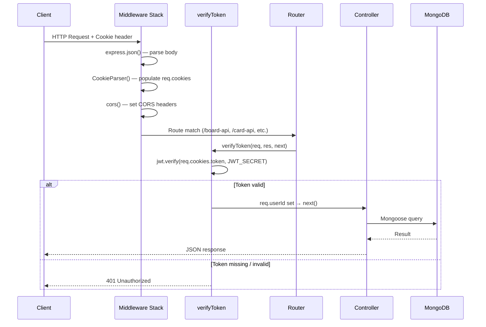
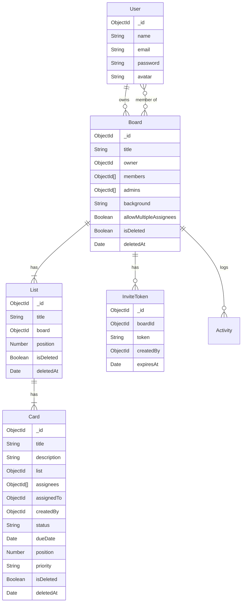
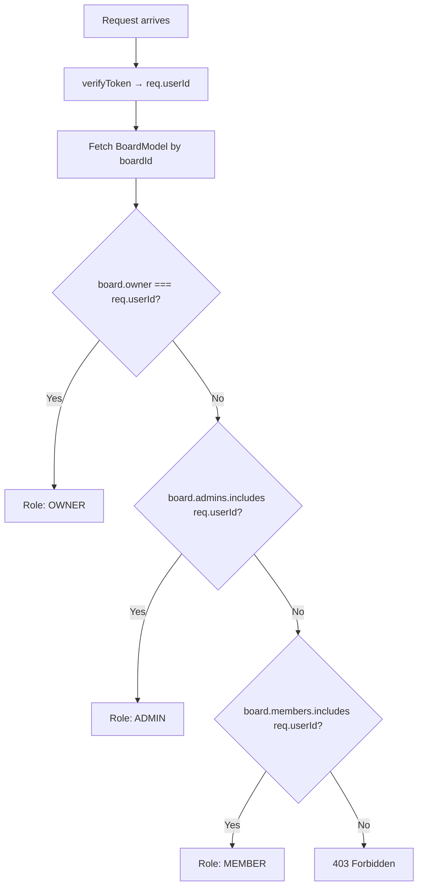
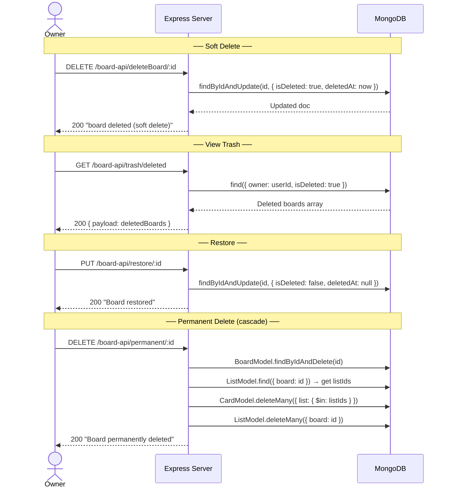
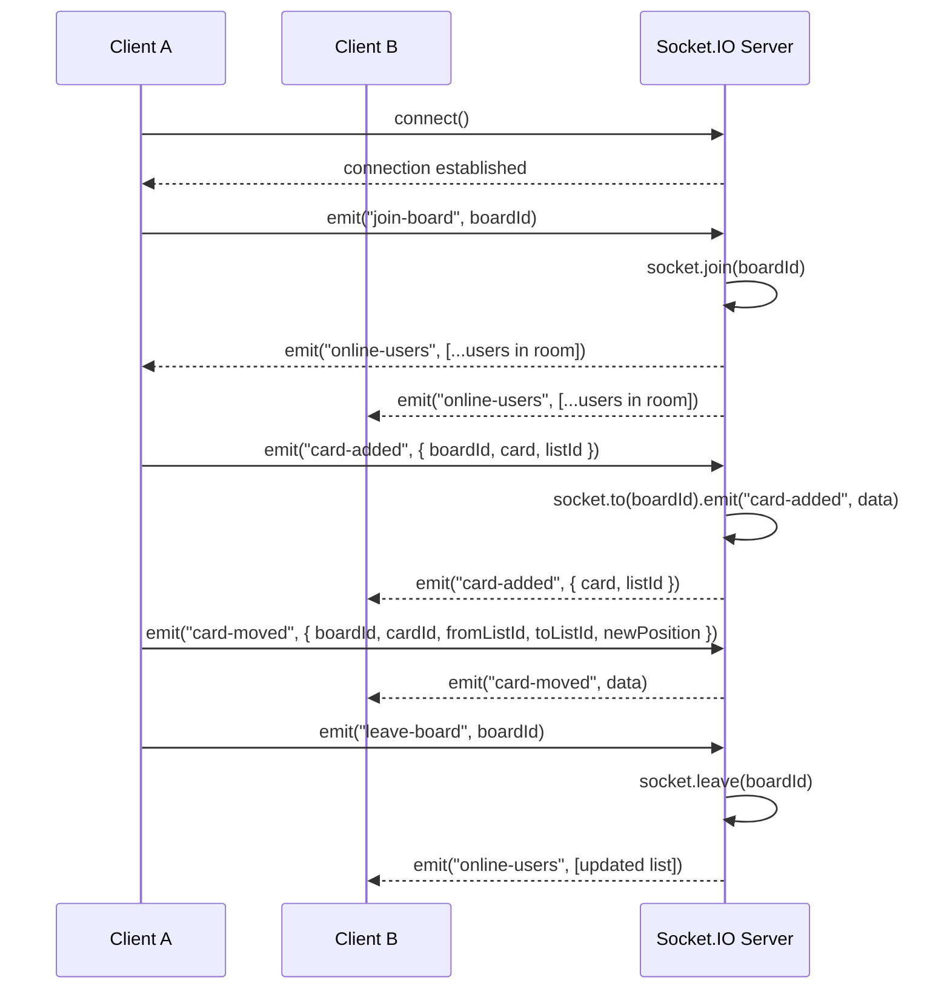
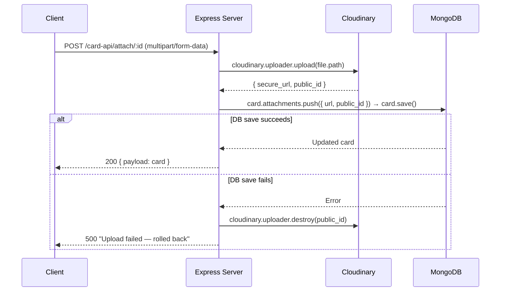
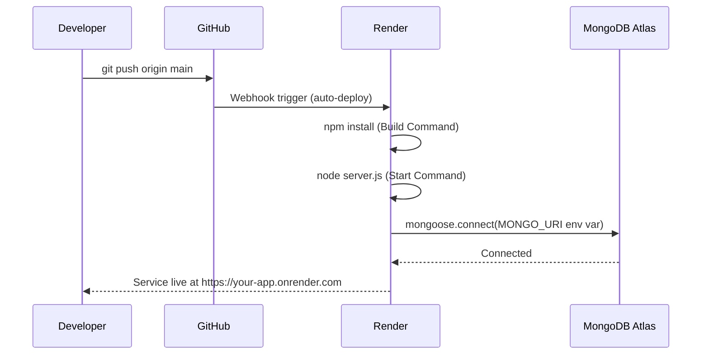

# ⚙️ Server — Node.js + Express Backend Documentation

A **Node.js + Express v5** REST API with **Mongoose v9**, **Socket.IO v4**, **JWT HttpOnly cookies**, **bcryptjs** hashing, and a full soft-delete trash system.

---

## 📦 Packages

### Dependencies

| Package | Version | Purpose |
|---------|---------|---------|
| `express` | ^5.2.1 | Web framework and HTTP routing |
| `mongoose` | ^9.3.0 | MongoDB ODM — schemas, models, queries |
| `bcryptjs` | ^3.0.3 | Password hashing and comparison |
| `jsonwebtoken` | ^9.0.3 | JWT generation and verification |
| `cookie-parser` | ^1.4.7 | Parse HttpOnly cookies from requests |
| `cors` | ^2.8.6 | Cross-Origin Resource Sharing middleware |
| `dotenv` | ^16.6.1 | Load environment variables from `.env` |
| `socket.io` | ^4.8.3 | WebSocket server (real-time events) |
| `socket.io-client` | ^4.8.3 | Socket client (server-side testing) |
| `date-and-time` | ^4.3.1 | Date formatting and manipulation |
| `cloudinary` | ^2.x | Cloud file storage (images, PDFs, docs) |
| `multer` | ^1.x | Multipart form data parsing (file uploads) |

### Dev Dependencies

| Package | Version | Purpose |
|---------|---------|---------|
| `nodemon` | ^3.1.14 | Auto-restart server on file changes |

---

## 🚀 Project Setup — Step by Step

### Step 1 — Initialize the Node.js project

```bash
mkdir server && cd server
npm init -y
```

### Step 2 — Add `"type": "module"` to `package.json`

```json
{
  "name": "server",
  "version": "1.0.0",
  "type": "module",
  "main": "server.js",
  "scripts": {
    "dev": "nodemon server.js",
    "start": "node server.js"
  }
}
```

### Step 3 — Install all packages

```bash
npm install express mongoose bcryptjs jsonwebtoken cookie-parser cors dotenv socket.io socket.io-client date-and-time
npm install -D nodemon
```

### Step 4 — Create `.env` in `server/` root

```env
PORT=4001
MONGO_URI=mongodb+srv://<user>:<pass>@cluster.mongodb.net/<db>?retryWrites=true&w=majority
JWT_SECRET_KEY=your_super_secret_key
CLIENT_URL=http://localhost:5173
```

### Step 5 — Create directory structure

```bash
mkdir config controllers models Apis sockets utils
touch server.js config/db.js utils/generateToken.js utils/verifyToken.js
```

### Step 6 — MongoDB connection (`config/db.js`)

```js
import mongoose from "mongoose";
const connectDB = async () => {
  await mongoose.connect(process.env.MONGO_URI);
  console.log("✅ MongoDB connected");
};
export default connectDB;
```

### Step 7 — JWT generator (`utils/generateToken.js`)

```js
import jwt from "jsonwebtoken";
import { config } from "dotenv";
config();
export const generateToken = (user) =>
  jwt.sign({ id: user._id }, process.env.JWT_SECRET_KEY, { expiresIn: "1d" });
```

### Step 8 — Auth middleware (`utils/verifyToken.js`)

```js
import jwt from "jsonwebtoken";
const verifyToken = (req, res, next) => {
  const token = req.cookies?.token;
  if (!token) return res.status(401).json({ message: "Unauthorized — no token" });
  try {
    const decoded = jwt.verify(token, process.env.JWT_SECRET_KEY);
    req.userId = decoded.id;
    next();
  } catch {
    return res.status(401).json({ message: "Invalid or expired token" });
  }
};
export default verifyToken;
```

### Step 9 — Entry point (`server.js`)

```js
import exp from "express";
import { config } from "dotenv";
import connectDB from "./config/db.js";
import CookieParser from "cookie-parser";
import http from "http";
import { Server } from "socket.io";
import cors from 'cors';
import UserApi from "./Apis/UserApi.js";
import BoardApp from './Apis/BoardApi.js';
import ListApp from "./Apis/ListApi.js";
import CardApp from "./Apis/CardApi.js";
import boardSocket from "./sockets/boardSocket.js";

export const app = exp();
config();

app.use(exp.json());
app.use(CookieParser());
app.use(cors({ origin: true, credentials: true }));

app.use("/user-api", UserApi);
app.use("/board-api", BoardApp);
app.use("/list-api", ListApp);
app.use("/card-api", CardApp);

await connectDB();

const server = http.createServer(app);
const io = new Server(server, { cors: { origin: true, credentials: true } });
boardSocket(io);

server.listen(process.env.PORT || 4001, () =>
  console.log(`🚀 Server running on port ${process.env.PORT || 4001}`)
);
```

### Step 10 — Start the dev server

```bash
npm run dev   # Nodemon watches and auto-restarts
```

---

## 🗄️ Express Pipeline & Middleware

### Request Flow Diagram



### Global Error Handler (recommended addition)

```js
app.use((err, req, res, next) => {
  console.error(err.stack);
  res.status(err.status || 500).json({ message: err.message || "Internal Server Error" });
});
```

---

## 🔐 Authentication — Bcrypt, JWT & HttpOnly Cookies

### Signup → Login → Protected Request Flow

```mermaid
sequenceDiagram
    actor U as User
    participant S as Express Server
    participant DB as MongoDB

    Note over U,DB: ── Signup ──
    U->>S: POST /user-api/signup { name, email, password }
    S->>DB: UserModel.findOne({ email }) → check duplicate
    S->>S: bcrypt.hash(password, 8) — salt rounds = 8
    S->>DB: new UserModel({ name, email, hashedPassword }).save()
    S-->>U: 201 { message: "user created successfully" }

    Note over U,DB: ── Login ──
    U->>S: POST /user-api/signin { email, password }
    S->>DB: UserModel.findOne({ email })
    S->>S: bcrypt.compare(password, user.password)
    S->>S: jwt.sign({ id: user._id }, JWT_SECRET, { expiresIn: "1d" })
    S-->>U: 200 { payload: user } + Set-Cookie: token=<JWT>; HttpOnly; SameSite=Lax; Max-Age=7d

    Note over U,DB: ── Protected Request ──
    U->>S: GET /board-api/ (Cookie: token=<JWT> auto-sent)
    S->>S: verifyToken → jwt.verify → req.userId
    S->>DB: BoardModel.find({ owner: req.userId })
    S-->>U: 200 { payload: boards }
```

### Cookie Flags Explained

| Flag | Value | Reason |
|------|-------|--------|
| `httpOnly` | `true` | Blocks JS access — XSS protection |
| `maxAge` | 7 days in ms | Session persistence |
| `secure` | `false` (dev) / `true` (prod) | HTTPS-only in production |
| `sameSite` | `"lax"` (dev) / `"none"` (prod) | CSRF protection |

---

## 🗃️ Mongoose Models

### Schema Relationships



### Field Tables

#### Board (`Board.js`)

| Field | Type | Required | Notes |
|-------|------|----------|-------|
| `title` | String | ✅ | trim, maxLength: 100 |
| `owner` | ObjectId → User | ✅ | set from JWT |
| `members` | [ObjectId] | ❌ | default: [] |
| `admins` | [ObjectId] | ❌ | default: [] |
| `background` | String | ❌ | default: `#0052cc` |
| `allowMultipleAssignees` | Boolean | ❌ | default: false |
| `isDeleted` | Boolean | ❌ | soft-delete flag |
| `deletedAt` | Date | ❌ | soft-delete timestamp |

#### Card (`Card.js`)

| Field | Type | Required | Notes |
|-------|------|----------|-------|
| `title` | String | ✅ | trim, maxLength: 200 |
| `description` | String | ❌ | default: `""` |
| `list` | ObjectId → List | ✅ | indexed |
| `assignees` | [ObjectId] | ❌ | multiple assignees |
| `assignedTo` | ObjectId → User | ❌ | primary assignee |
| `createdBy` | ObjectId → User | ❌ | creator ref |
| `status` | String (enum) | ❌ | `"to do"` / `"in progress"` / `"completed"` |
| `dueDate` | Date | ❌ | default: null |
| `position` | Number | ✅ | ordering index |
| `priority` | String (enum) | ❌ | `"High"` / `"Medium"` / `"Low"` / `""` |
| `labels` | [String] | ❌ | Custom labels array (default: []) |
| `attachments` | [Attachment] | ❌ | Sub-document array (see below) |
| `remarks` | [Remark] | ❌ | Sub-document array (see below) |
| `isDeleted` | Boolean | ❌ | default: false |
| `deletedAt` | Date | ❌ | soft-delete timestamp |

#### Attachment Sub-schema (shared by card attachments and remarks)

| Field | Type | Required | Notes |
|-------|------|----------|-------|
| `name` | String | ✅ | Original file name |
| `url` | String | ✅ | Cloudinary secure URL |
| `type` | String | ❌ | MIME type |
| `size` | Number | ❌ | File size in bytes |
| `publicId` | String | ❌ | Cloudinary public ID for deletion |
| `uploadedBy` | ObjectId → User | ❌ | User who uploaded the file |
| `uploadedAt` | Date | ❌ | Defaults to `Date.now` |

#### Remark Sub-schema

| Field | Type | Required | Notes |
|-------|------|----------|-------|
| `text` | String | ❌ | Remark body text |
| `attachments` | [Attachment] | ❌ | Files attached to the remark |
| `author` | ObjectId → User | ✅ | Remark author reference |
| `createdAt` | Date | auto | Mongoose `timestamps: true` |
| `updatedAt` | Date | auto | Mongoose `timestamps: true` |

#### User (`User.js`)

| Field | Type | Required | Notes |
|-------|------|----------|-------|
| `name` | String | ✅ | trim, minlength: 2 |
| `email` | String | ✅ | unique, lowercase |
| `password` | String | ✅ | minlength: 6 (stored hashed) |
| `avatar` | String | ❌ | Cloudinary URL (default: `""`) |

#### List (`List.js`)

| Field | Type | Required | Notes |
|-------|------|----------|-------|
| `title` | String | ✅ | trim, maxLength: 100 |
| `board` | ObjectId → Board | ✅ | indexed |
| `position` | Number | ❌ | ordering index (default: 0) |
| `cards` | [ObjectId] → Card | ❌ | ordered card references |
| `isDeleted` | Boolean | ❌ | soft-delete flag |
| `deletedAt` | Date | ❌ | soft-delete timestamp |

#### Activity (`Activity.js`)

| Field | Type | Required | Notes |
|-------|------|----------|-------|
| `board` | ObjectId → Board | ✅ | indexed |
| `user` | ObjectId → User | ✅ | who performed the action |
| `action` | String | ✅ | human-readable action description |
| `timestamp` | Date | ❌ | Defaults to `Date.now` |

---

## 🌐 REST API Endpoints

### User API — `/user-api`

| Method | Endpoint | Auth | Payload | Description |
|--------|----------|------|---------|-------------|
| `POST` | `/signup` | ❌ | `{ name, email, password }` | Register |
| `POST` | `/signin` | ❌ | `{ email, password }` | Login + set cookie |
| `POST` | `/logout` | ❌ | — | Clear cookie |
| `GET` | `/verify` | ✅ | — | Validate session |
| `GET` | `/search?q=` | ✅ | `q` query param | Search users |
| `POST` | `/upload-avatar` | ❌ | `FormData (avatar)` | Upload profile picture to Cloudinary |

### Board API — `/board-api`

| Method | Endpoint | Role | Payload | Description |
|--------|----------|------|---------|-------------|
| `POST` | `/addBoard` | Any | `{ title, background }` | Create board + 3 default lists |
| `GET` | `/` | Any | — | Own boards |
| `GET` | `/shared/all` | Any | — | Shared boards |
| `GET` | `/:id` | Member+ | — | Single board (populated) |
| `PUT` | `/updateBoard/:id` | Owner | `{ title, allowMultipleAssignees }` | Update settings |
| `DELETE` | `/deleteBoard/:id` | Owner | — | Soft delete |
| `GET` | `/trash/deleted` | Owner | — | Deleted boards |
| `PUT` | `/restore/:id` | Owner | — | Restore |
| `DELETE` | `/permanent/:id` | Owner | — | Hard delete (cascade) |
| `PUT` | `/manage-member/:boardId` | Owner/Admin | `{ memberId, action }` | promote / demote / remove |
| `POST` | `/invite/email/:boardId` | Owner | `{ email }` | Add user directly |
| `POST` | `/invite/link/:boardId` | Owner | — | Generate invite link |
| `GET` | `/invite/accept/:token` | Authenticated | — | Accept invite |
| `GET` | `/activity/:boardId` | Member+ | — | Get board activity log |

### List API — `/list-api`

| Method | Endpoint | Role | Payload | Description |
|--------|----------|------|---------|-------------|
| `POST` | `/addList` | Owner/Admin | `{ title, board, position }` | Create list |
| `GET` | `/getLists/:boardId` | Member+ | — | Get all lists |
| `GET` | `/getListById/:id` | Member+ | — | Single list |
| `PUT` | `/updateList/:id` | Owner/Admin | `{ title }` | Rename |
| `DELETE` | `/deleteList/:id` | Owner/Admin | — | Soft delete |
| `GET` | `/trash/deleted/:boardId` | Member+ | — | Deleted lists |
| `PUT` | `/restore/:id` | Owner/Admin | — | Restore |
| `DELETE` | `/permanent/:id` | Owner | — | Hard delete |

### Card API — `/card-api`

| Method | Endpoint | Role | Payload | Description |
|--------|----------|------|---------|-------------|
| `POST` | `/addCard` | Member+ | `{ title, list, position }` | Create card |
| `GET` | `/getCards/:listId` | Member+ | — | Cards for list |
| `GET` | `/getCardById/:id` | Member+ | — | Single card |
| `PUT` | `/updateCard/:id` | See note | `{ title, description, dueDate, priority, status, assignedTo, assignees }` | Update |
| `PUT` | `/moveCard/:id` | Member+ | `{ toListId, newPosition }` | Move card |
| `DELETE` | `/deleteCards/:id` | Owner/Admin | — | Soft delete |
| `GET` | `/trash/deleted/:boardId` | Member+ | — | Deleted cards |
| `PUT` | `/restore/:id` | Owner/Admin | — | Restore |
| `DELETE` | `/permanent/:id` | Owner | — | Hard delete |

### Attachment & Remark API — `/card-api` (continued)

| Method | Endpoint | Role | Payload | Description |
|--------|----------|------|---------|-------------|
| `POST` | `/attachments/:cardId` | Member+ | `FormData (files)` | Upload up to 5 files to a card |
| `DELETE` | `/attachments/:cardId/:attachmentId` | Owner/Admin | — | Delete a specific attachment |
| `POST` | `/remarks/:cardId` | Member+ | `FormData (text, files)` | Add a remark with optional files |
| `DELETE` | `/remarks/:cardId/:remarkId` | Owner/Admin | — | Delete a specific remark |

> **File Handling:** Files are uploaded via Multer (memory storage) and streamed to Cloudinary. No temporary files are written to disk.

---

## 👥 Role-Based Access

### Role Resolution



### Permission Matrix

| Operation | Owner | Admin | Member |
|-----------|-------|-------|--------|
| View board | ✅ | ✅ | ✅ |
| Add cards | ✅ | ✅ | ✅ |
| Update card status | ✅ | ✅ | ✅ |
| Update card details | ✅ | ✅ | ❌ |
| Add / rename lists | ✅ | ✅ | ❌ |
| Soft-delete lists/cards | ✅ | ✅ | ❌ |
| Invite members | ✅ | ✅ | ❌ |
| Manage members | ✅ | ❌ | ❌ |
| Update board settings | ✅ | ✅ | ❌ |
| Delete board / hard delete | ✅ | ❌ | ❌ |

---

## 🗑️ Soft Delete System

### Delete → Trash → Restore / Permanent Delete



---

## 🔌 Socket.IO — Real-Time Events

### boardSocket.js Flow



### Event Reference

| Event | Direction | Payload |
|-------|-----------|---------|
| `join-board` | Client → Server | `boardId` |
| `leave-board` | Client → Server | `boardId` |
| `online-users` | Server → Client | `[socketIds]` |
| `card-added` | Broadcast | `{ boardId, card, listId }` |
| `card-updated` | Broadcast | `{ boardId, cardId, listId, updates, targetListId }` |
| `card-deleted` | Broadcast | `{ boardId, cardId, listId }` |
| `card-moved` | Broadcast | `{ boardId, cardId, fromListId, toListId, newPosition }` |
| `list-added` | Broadcast | `{ boardId, list }` |
| `list-updated` | Broadcast | `{ boardId, listId, title }` |
| `list-deleted` | Broadcast | `{ boardId, listId }` |
| `board-updated` | Broadcast | `{ boardId, ...updates }` |
| `member-updated` | Broadcast | `{ boardId, board }` |

---

## 🌐 Multer & Cloudinary (File Uploads)

### Upload Middleware (`utils/upload.js`)

The upload utility uses **Multer with `memoryStorage()`** to hold files in memory buffers, which are then streamed to Cloudinary in the controller layer.

| Export | Method | Max Size | Filter | Usage |
|--------|--------|----------|--------|-------|
| `uploadAvatar` | `.single("avatar")` | 5 MB | Images only | User registration/profile |
| `uploadFiles` | `.array("files", 5)` | 10 MB each | Images, PDF, Word, Excel, PPT, Text, CSV, ZIP, RAR | Card attachments & remarks |

### Cloudinary Configuration (`config/cloudinary.js`)

```js
import { v2 as cloudinary } from "cloudinary";
cloudinary.config({
  cloud_name: process.env.CLOUDINARY_CLOUD_NAME,
  api_key: process.env.CLOUDINARY_API_KEY,
  api_secret: process.env.CLOUDINARY_API_SECRET,
});
export default cloudinary;
```

### Integration Steps

```bash
npm install multer cloudinary multer-storage-cloudinary
```

```js
// config/cloudinary.js
import { v2 as cloudinary } from 'cloudinary'
import { CloudinaryStorage } from 'multer-storage-cloudinary'
import multer from 'multer'

cloudinary.config({
  cloud_name: process.env.CLOUDINARY_CLOUD_NAME,
  api_key:    process.env.CLOUDINARY_API_KEY,
  api_secret: process.env.CLOUDINARY_API_SECRET,
})

const storage = new CloudinaryStorage({
  cloudinary,
  params: { folder: 'task-manager', allowed_formats: ['jpg', 'png', 'pdf'] }
})

export const upload = multer({ storage })
```

### Upload + DB Rollback Sequence



---

## ⚙️ Environment Parameters

| Variable | Required | Description |
|----------|----------|-------------|
| `PORT` | ❌ | Server port (default: `4001`) |
| `MONGO_URI` | ✅ | MongoDB Atlas connection string |
| `JWT_SECRET_KEY` | ✅ | Secret for signing/verifying JWTs |
| `CLIENT_URL` | ❌ | Frontend URL for CORS |
| `CLOUDINARY_CLOUD_NAME` | ❌ | For file uploads |
| `CLOUDINARY_API_KEY` | ❌ | For file uploads |
| `CLOUDINARY_API_SECRET` | ❌ | For file uploads |

---

## 🚀 Render Deployment

### Deployment Flow



### Render Setup Checklist

1. **New Web Service** → connect GitHub repo
2. **Root Directory** → `server`
3. **Build Command** → `npm install`
4. **Start Command** → `npm start`
5. **Environment Variables** → add all from table above

### Production Cookie & CORS Update

```js
// Production cookies
res.cookie('token', token, {
  httpOnly: true,
  maxAge: 7 * 24 * 60 * 60 * 1000,
  secure: true,       // ← HTTPS only
  sameSite: "none"    // ← Required for cross-site
})

// Production CORS
app.use(cors({
  origin: process.env.CLIENT_URL,
  credentials: true
}))
```

---

## 🛠️ Nodemon Dev Server

```bash
npm run dev     # nodemon server.js — auto-restarts on save
npm start       # node server.js — production start
```

Optional `nodemon.json`:

```json
{
  "watch": ["server.js", "controllers", "models", "Apis", "sockets", "utils", "config"],
  "ext": "js",
  "ignore": ["node_modules"]
}
```
